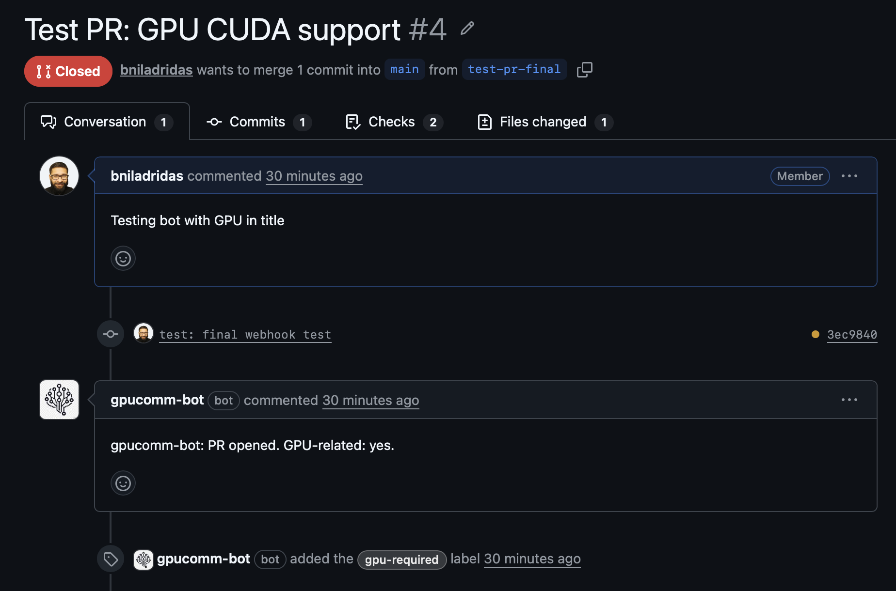
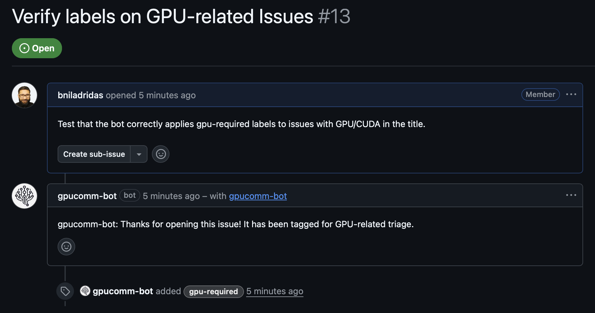

# gpucomm-bot

GPU-aware automation and CI engine for the gpucomm organization.

## Features
- GPU / CUDA validation in PRs
- CI checks for compute pipelines
- Benchmark triggers before release
- Issue and PR automation

## Commands
- /gpu-check → run GPU validation
- /benchmark → run performance tests
- /pause → pause automation
- /analyze → manual validation

## Philosophy
Minimal, GPU-focused, automation-first.

## Deployment

### Local Development

1. Copy `.env.example` to `.env` and fill in values
2. Install dependencies: `npm install`
3. Start the bot: `npm start`
4. For public webhook access, use [ngrok](https://ngrok.com):
   ```bash
   ngrok http 3000
   ```
   Use the ngrok HTTPS URL + `/webhook` as your GitHub App webhook URL.

### Production (Render)

We tried Railway first but the trial expired. [Render](https://render.com) was used instead with free tier.

1. Create a Render account and connect your GitHub repo
2. Create a Web Service with:
   - Build Command: `npm install`
   - Start Command: `npm start`
   - Plan: Free
3. Add environment variables:
   ```
   PORT=3000
   HOST=0.0.0.0
   WEBHOOK_SECRET=<your-secret>
   GITHUB_APP_ID=<your-app-id>
   GITHUB_INSTALLATION_ID=<your-installation-id>
   GITHUB_PRIVATE_KEY_B64=<base64-encoded-pem>
   GPUCOMM_GPU_LABEL=gpu-required
   ```

## GitHub App Setup

1. **Create**: Go to https://github.com/settings/apps/new and create an app named `gpucomm-bot`
2. **Install**: Install the app on your account/org at https://github.com/apps/gpucomm-bot/installations/new
3. **Webhook**: In GitHub App settings → Webhook, enter `https://<your-domain>/webhook`
4. **Permissions**: Set to: Pull requests (read/write), Issues (read/write), Contents (read), Metadata (read)
5. **Events**: Subscribe to: Pull request, Issues, Release
6. **Private key**: Generate a private key, then convert to base64:
   ```bash
   base64 -i private-key.pem | tr -d '\n'
   ```

### Bot in Action

PR with gpu-required label applied:



Issue with bot comment:



## Real GPU CI
`GPU CI` (`.github/workflows/gpu.yml`) is configured for a self-hosted runner with NVIDIA drivers + CUDA toolkit.

- Runner labels: `self-hosted`, `linux`, `x64`, `gpu`
- Workflow gate: runs only if PR has label `gpu-required` **or** the PR title contains `gpu`/`cuda`
- CUDA smoke test: `bash scripts/gpu-ci.sh` (compiles `scripts/cuda_smoke_test.cu` with `nvcc`)
- Optional: set `GPUCOMM_ENFORCE_CUDA_VERSION=true` to enforce `config/gpu.json.allowed_cuda_versions`
- PyTorch smoke test: set repo/org variable `PYTORCH_INDEX_URL` (example: `https://download.pytorch.org/whl/cu121`) then run `bash scripts/gpu-ci.sh pytorch`

## GitHub App auth
To let the bot comment/label on PRs, configure these environment variables for the running service:

- `GITHUB_APP_ID`: GitHub App ID
- `GITHUB_INSTALLATION_ID`: installation ID for the target org/repo
- `GITHUB_PRIVATE_KEY` (PEM string) **or** `GITHUB_PRIVATE_KEY_B64` (base64 PEM)
- Optional: `GITHUB_API_URL` (defaults to `https://api.github.com`, set this for GHES)
- Optional: `GPUCOMM_GPU_LABEL` (label name to apply for GPU-related PRs; label should already exist)
